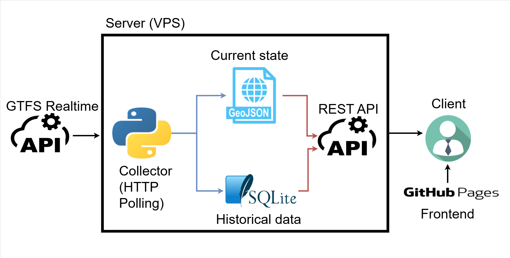

[Dashboard](https://joseantonio002.github.io/FGC-transit-realtime-dashboard/)

## TL;DR

I built a small GTFS-Realtime dashboard for **FGC** (Ferrocarrils de la Generalitat de Catalunya, aka Catalan Government Railways) that shows live vehicle markers with useful information like occupation status + stop popups showing upcoming arrivals, plus two panels listing the most delayed routes and stops historically.

Throughout the project, I practiced:

- GTFS Static (Scheduled) vs Realtime formats (including protobuf decoding)
- Realtime ingestion via HTTP polling in Python, dealing with an unstable/laggy data source and transforming snapshots into JSON for the frontend
- Designing a system that’s reliable and maintainable (idempotent, retry/backoff, dedupe rules, logging, clear data contracts)
- Building and running services with Docker, Dockerfiles, and Docker Compose
- SQLite + SQL for a lightweight historical store and aggregations
- FastAPI for a small REST API serving snapshots + “top delays” endpoints

Important: the deployed GitHub Pages version is just a demo of how it works. It does not use the realtime feeds directly (full explanation at the end, see “Why the GitHub Pages demo loops”).

## Intro: what this project is (and what problem it solves)

**FGC Transit Realtime Dashboard** is a lightweight “[GeoTren](https://geotren.fgc.cat/)-ish” dashboard that answers two simple questions:
1) *What’s happening right now?*  
Where are the vehicles, what’s their next stop, and what are the upcoming arrivals for each stop?
2) *What’s been historically painful?*  
Which routes and stops accumulate the biggest average delays?
The goal was to build something **autonomous**, **cheap to host**, and **pleasant to look at**, while learning the real-world quirks of GTFS Realtime.

## The Beginning: a plan, a dataset… and a wrong assumption

Early on, I picked a GTFS dataset from **TITSA** thinking it included observed/real operations. It didn’t, it was basically **scheduled trips** with dates far in the future—useful, but not enough to compute actual delays.
That moment forced the first pivot:
- GTFS **Scheduled** = what *should* happen (routes, trips, stop_times, shapes)
- GTFS **Realtime** = what *is happening* (vehicle positions, trip updates, alerts) — and it comes as **protobuf**, not JSON
Once I accepted “ok, I need GTFS-RT”, I landed on FGC’s realtime feeds and started building around them.
---
## The core architecture: “current state” snapshots + “historic” SQLite
The project follow this architecture:

- A **collector** process polls GTFS-Realtime feeds (HTTP polling), parses protobuf, and:
  - writes JSON snapshots like `vehicles.json`, `arrival_times.json` (the *current state/snapshot*)
  - stores delay events into SQLite (the *historic state*)
- An **API** exposes those files and a few aggregated endpoints for the UI
- A **frontend** (Leaflet + OSM tiles) reads the snapshots and renders the dashboard
The key idea here (and it shows in the log around mid-February) is: **don’t query the database for realtime map refreshes**. Just write a “latest snapshot” JSON file and serve it. SQLite stays for analytics/history.

## Things That Didn’t Work (or at least weren’t as easy as they sounded)

I went into this thinking “I know what GTFS looks like, I’ll just parse it and draw a map.” Reality check: I didn’t know how this specific feed behaved in practice (update frequency, missing fields, timing drift between feeds, whether stops disappear, etc.). So before committing to any “delay algorithm”, I wrote small experiments and watched the feeds for real.
Those tests (especially the lingering tests in LOG.md) led to a few conclusions that basically dictated the design:
- The feeds update roughly every ~100 seconds, and different feeds aren’t always perfectly synchronized.
- Data isn’t perfectly “clean”: entities can disappear, reappear, skip stops, or change platform IDs.
- If I wanted something reliable, I had to build around what the data actually does, not what the spec suggests it could do.

### 1) “Realtime” wasn’t really realtime
The lingering tests made this super clear: feeds update ~every ~100 seconds and the positions are often **2–3 minutes behind** what you see on official tools. That changed expectations: the dashboard is accurate-ish, but not “subway control room” accurate.

### 2) VehiclePosition isn’t enough for delays
VehiclePosition tells you “here’s the GPS, here’s a stop_id-ish reference”, but not reliable arrival times. TripUpdates *does* give stop-level predicted times, so the delay logic centered around TripUpdates + scheduled `stop_times.txt`.

### 3) Scheduled vs realtime time systems are different
Static `stop_times.txt` uses *service day times* (`HH:MM:SS`, even >24h). Realtime uses **epoch seconds**. So you have to map:
- `start_date` (service date) + agency timezone  
to  
- “midnight epoch” + scheduled seconds-of-day
That logic became the foundation of delay calculation in `apps/collector/src/collector/gtfs_to_json.py` via helpers like `_service_midnight_epoch(...)` and `_convert_hhmmss_to_epoch(...)`.

### 4) Stops can “change” because platforms change
A fun real-world issue: stop IDs sometimes include platform suffixes (`ME2` vs `ME1`). Scheduled data might list one, realtime might send another. That’s why the code ended up using a “same base stop, different platform” fallback.

## Iterations & Improvements: how it got better over time

### The collector grew up: retries, backoff, and “only process when feeds update”

The collector got shaped into an idempotent polling loop:
- fetch snapshots
- retry a bounded amount if timestamps didn’t advance
- exponential backoff on repeated failures
- only run “processing” when there’s new data

### Delay detection: “a stop was reached when it disappears”

One of the cooler insights from the lingering tests: when a vehicle reaches a stop, that stop often disappears from TripUpdate’s `stop_time_update` list in the next snapshot or two.
So delay events are detected like this:
- Compare previous trip feed dict vs current trip feed dict
- For stops that existed before but not now → treat that as “we reached it”
- Compute delay (realtime vs planned) and store it to SQLite

And to avoid duplicate inserts / weird reappearance behavior, the collector only treats a trip as “fully finished” when it disappears and **only the last stop remains** (the tradeoff is: you might miss some stops, but you keep the dataset clean).

### Logging: the “prints are fine until they aren’t” refactor

Once the collector was running continuously, `print()` wasn’t enough. The code moved to `logging` with `RotatingFileHandler` so logs don’t grow forever:
- `maxBytes=800_000`
- `backupCount=3`
in `apps/collector/src/collector/collector.py`.
And logs were standardized with prefixes like `S=<script> F=<function> ...`, which makes debugging a lot less annoying when everything is just “some loop in a container”.

### API: thin file-serving plus two aggregation endpoints

The API stayed intentionally simple:
- serve `vehicles.json`, `arrival_times.json`, `stops.json`, `shapes.json`
- query SQLite for:
  - `/top_routes`
  - `/top_stops`
in `apps/api/src/main.py`.

The frontend is in charge of calling this API.

## Closing Thoughts: where it ended up, and what’s next

At the end of this, I basically ended up with a clean little “mini platform”:
- Python ingestion of GTFS-Realtime protobuf feeds (HTTP polling) + JSON snapshot generation
- A SQLite historical table for delays + simple aggregations
- A small FastAPI layer to serve “current state” and “top delays”
- A Leaflet + OpenStreetMap frontend that stays lightweight and does the rendering and filtering
- Everything containerized with Docker / Docker Compose, so running it elsewhere is mostly “clone + docker compose up --build”

At this point, the project has two “faces”:
- **`apps/`**: the real system (collector + API + frontend) that can run with Docker Compose
- **`docs/`**: the GitHub Pages demo version (no backend)
If I eventually decide it’s worth paying for a VPS, the deployment steps are basically what you wrote in the log (22/03/2026), but with a clearer order:
1) **Make the API secure** (SSL/HTTPS, rate limiting, CORS locked to your frontend origin)
2) **Switch the deployed frontend** from static demo data back to API calls  
   (i.e., replace `docs/index.html` with the `apps/frontend/index.html` version, or run a proper webserver container on the VPS)
3) **Deploy with Docker Compose**: `docker compose up --build`

## Why the GitHub Pages demo loops (and why that’s intentional)

GitHub Pages can only host **static files**—no Python collector, no FastAPI, no SQLite queries. But the dashboard is mostly “read JSON, draw map, refresh vehicles”.
So instead of paying for a VPS just for this project what I did was:
- Run a special script (`apps/collector/src/collector/collector_compile.py`) to record **41 snapshots** of vehicles and arrival times
- Make `docs/index.html` load:
  - static: `docs/data/stops.json`, `docs/data/shapes.json`, `docs/data/top_routes.json`, `docs/data/top_stops.json` once
  - “realtime”: every 40 seconds, increment frame number `0→40`, then wrap to `0`
That’s the “loop”: it’s not live data—it’s a prerecorded reel that makes the page *feel* realtime while staying fully static.

